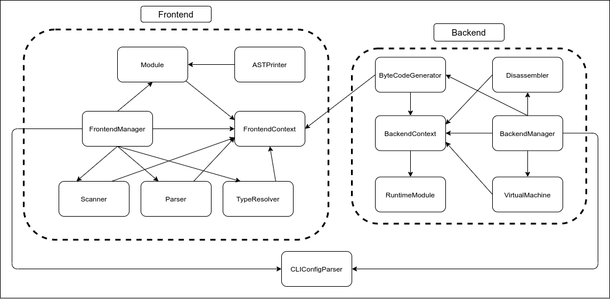

# Architecture

This file describes the architecture of the nyx interpreter.

<u>Note</u>: An arrow from A to B in the above diagram means "A accesses B" or "A controls B".

## Frontend

### `AST/ASTPrinter` - Dump AST in readable form

- Utility which prints the AST generated by the Parser in a human-readable format.
- Implements the `Visitor` interface as defined in `AST.hpp`.

### `Frontend/FrontendContext` - Store information for use in the frontend

- Stores all context information for the frontend, such as imported modules, module paths, config flags and the error logger.

### `Frontend/FrontendManager` - Handle setting up and running the frontend

- Controls parsing and type-checking for **one** module. A Parser recursively creates instances of this class for each imported module.
- For a given tree of modules in a program, each instance of this class used shares the same FrontendContext.
- Effectively a wrapper around a Parser and TypeResolver for simplified usage.

### `Frontend/Module.hpp` - Store all information about a module

- Represents one module during compile time in the program.
- Stores details such as path to the module, the source code, and all the statements contained within.

### `Frontend/Parser/Parser` - Parse given source code into an AST

- Implements an LL(1) predictive recursive-descent parser for the grammar defined by the `grammar.bnf` file.
- The AST generated by the Parser should not be considered complete/usable until the TypeResolver has filled the synthesized and inherited attributes for the various nodes.
- The AST is generated using the node types defined in `AST.hpp`.

### `Frontend/Parser/TypeResolver` - Type check an AST

- Implements the type checking and access resolution for the AST generated by the Parser.
- Implements the `Visitor` interface as defined in `AST.hpp`.

### `Frontend/Scanner/Scanner` - Convert source code into tokens

- Takes as input the source code in string form and emits a continuous stream of tokens.
- The Parser uses an instance of this class to tokenize the source code.

---

## Backend

### `Backend/BackendContext` - Store information for use in the backend

- Stores all context information for the backend, such as compiled modules, module paths, config flags and the error logger.

### `Backend/BackendManager` - Handle setting up and running the backend

- Controls code generation and execution for **all** modules.
- Only one instance of this class should be created for a given program.
- Effectively a wrapper around a ByteCodeGenerator, a VirtualMachine and disassemble functions for simplified usage.

### `Backend/RuntimeModule` - Store all information about a compiled module

- Stores information such as bytecode, functions, the module name and the module path

### `Backend/CodeGenerators/ByteCodeGenerator` - Generate bytecode for an AST

- Emits bytecode for a given module as per the instruction set defined in `Instructions.hpp`
- Assumes that the AST given to it is valid.
- Implements the `Visitor` interface as defined in `AST.hpp`

### `Backend/VirtualMachine/Disassembler` - Disasssemble generated bytecode

- Set of utility functions to disassemble bytecode generated by the ByteCodeGenerator
- Operates at various levels: per-BackendContext, per-RuntimeModule, per-Chunk, and per-instruction levels

### `Backend/VirtualMachine/VirtualMachine` - Run generated bytecode

- Implements the instruction set defined in `Instructions.hpp` as a stack-machine.
- Contains optional machinery for tracing the execution of code, in terms of the instruction being executed, the value-stack, the frame-stack, the module-stack and module initialization/teardown.

---

## Miscellaneous

### `CLIConfigParser` - Parse and manage command line flags

- Uses the `cxxopts` C++ library to parse command line flags, then stores them after verifying them (if possible) for use by the frontend and backend. 
