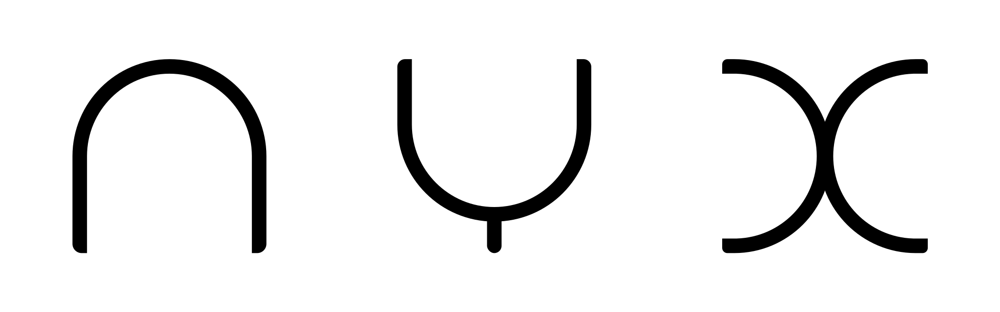

---

## Deterministically simple.

nyx is a simple, interpreted language written in C++.

```rs
/*
 * Class to implement a wrapper around a tuple
 */
class Foo {
    // Variable to store the tuple
    public var x = {1, "2", 3.0};

    public fn Foo()  -> Foo  { println("Constructors!"); }
    public fn ~Foo() -> null { println("And destructors too!"); }
}

fn main() -> int {
    const foos = [Foo(); 5] // Store 5 `Foo`s

    var range = 0..size(foos)
    ref range_ref = range // Make a reference to `range`

    for (var i = 0; i < size(foos); ++i) {
        const index = i + foos[i].x.0 - 1
        println(range_ref[index])
    }

    return 0
}
```

A reference of the language grammar is available in the file `grammar.bnf`.

### Features

- Strict, statically-typed type system
- Lexical scoping
- Deterministic object lifetimes, enabling the use of destructors
- No Garbage Collector
- Pseudo-UFCS, where methods are simply free functions scoped to the class name
- Optional semicolons, where a newline can be used as a statement terminator
  instead of a semicolon
- Copy, reference and move semantics

### Dependencies

- Any C++ compiler supporting C++17
- A build system such as `make` or `ninja`
- `cmake` 3.10 or later

### Building

The following commands will place the `nyx` executable in the `build/` directory
created at the project root
```shell
cmake -Bbuild .
cmake --build build/
```

If a build system other than `make` is preferred, it can additionally be passed
to `cmake` using the `-G` flag, for example `cmake -G Ninja ...`.

The build type can be specified as `Debug` or `Release` using the `--config`
flag to `cmake`, for example `cmake --config Release ...`.

<u>Note</u>: The release build enables LTO, so if `clang` is being used, linkers
like `gold`, `lld` which can compile clang's ThinLTO output are needed.

### License

The source code of `nyx` is licensed under GPLv3, and imported libraries have
their own licenses.